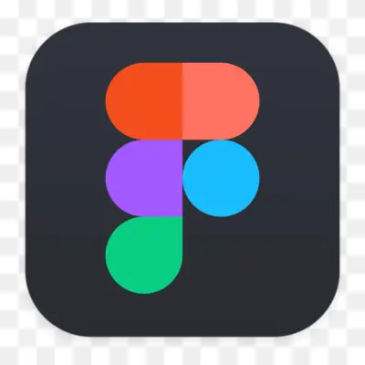
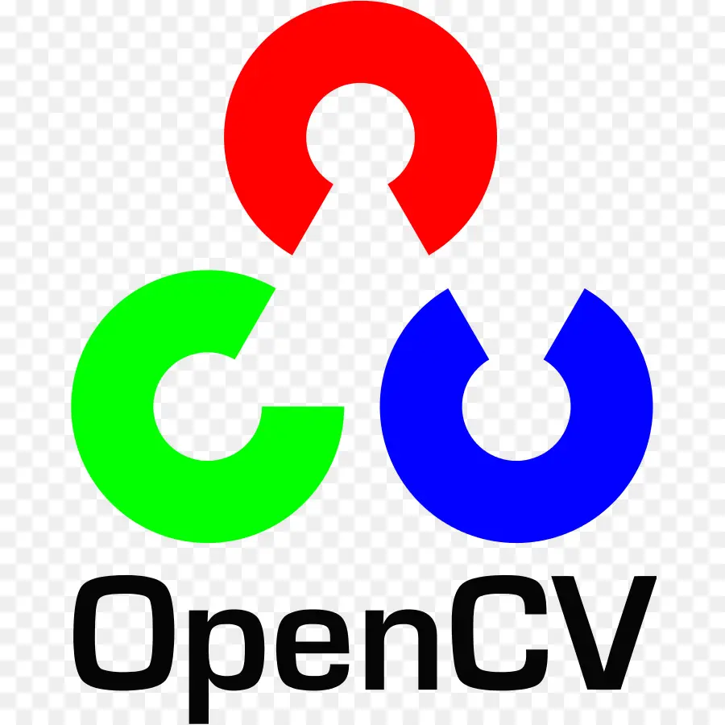
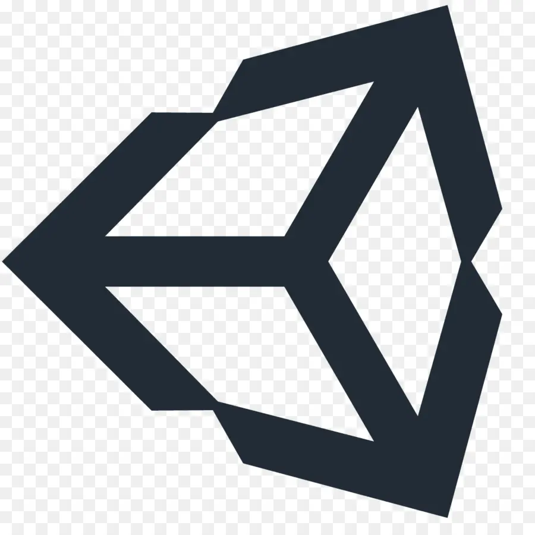
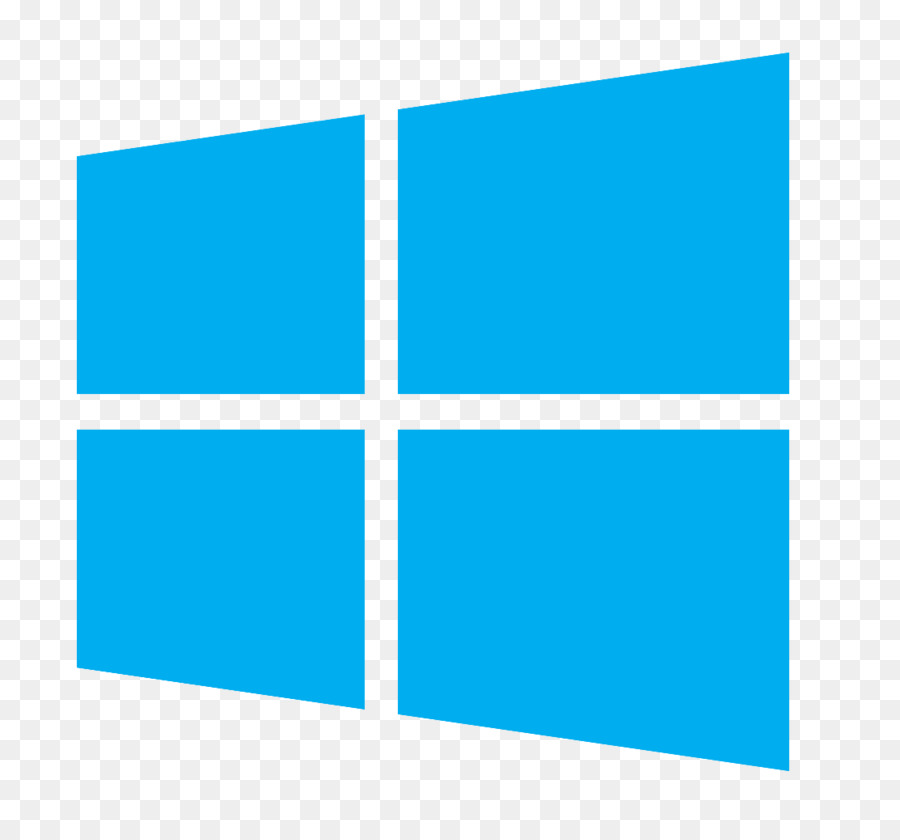

<h1 align="center">Hi 👋, I'm Hari Arunachalam</h1>
<h3 align="center">Cloud Computing Enthusiast | Data Analyst | Innovating with Python & SQL</h3>

  

- 👨‍💻 All of my projects are available at [https://github.com/Hari-Arunachalam](https://github.com/Hari-Arunachalam?tab=repositories)

- 📫 How to reach me hari.arunachalam01@gmail.com

- 📄 Know about my experiences [https://www.linkedin.com/in/hari-arunachalam/](https://www.linkedin.com/in/hari-arunachalam/)

<a href="https://www.credly.com/badges/4bf93c8b-d54f-4e2e-81f3-8f15fe095da3/public_url"> <a href="https://www.credly.com/badges/0ff5101c-cd1b-4de2-a501-e4f09334f286/linked_in_profile">

### Connect with me:

 

### SkillSet:

|  | **Tools** |
| --- | --- |
| **Languages** | </a><a href="https://www.python.org/">
| **FrontEnd** |  |
| **Databases** | </a> |
| **Softwares** |  |
| **BI Tools** | <a href="https://en.wikipedia.org/wiki/Tableau_Software">|
| **Libraries** |  |
| **Game Engines** | <a href="https://en.wikipedia.org/wiki/Unity_(game_engine)">|
| **Cloud Services** |  |
| **Platforms** |  |

